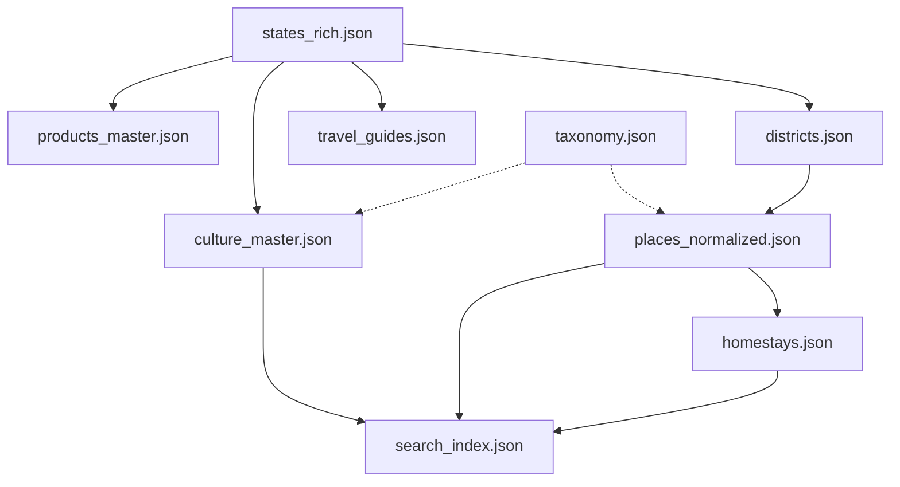

# SANGAI Project - Master Schema Architecture
> **Status:** FINAL
> **Purpose:** Blueprint for manual data gathering and seed file creation.
> **Architecture:** JSON-based Relational Data Model (10 Files)

---

## 🗺️ 1. Core Location Data (The Foundation)

### 1.1 `states_rich.json`
**Primary Key:** `_id` (ISO State Code, e.g., "AS", "MN")
**Purpose:** Powers `StateAtAGlanceSection` and `RegionPage` hero.

```json
{
  "_id": "MN",
  "slug": "manipur",
  "name": "Manipur",
  "tagline": "Jewel of India",
  "capital": "Imphal",
  "coordinates": { "lat": 24.817, "lng": 93.936 },
  "stats": {
    "population": "2.8 Million",
    "area": "22,327 sq km",
    "languages": ["Meitei", "English"],
    "landscapeType": "Hills & Valley",
    "climate": "Sub-tropical"
  },
  "images": {
    "hero": ["url1", "url2", "url3"], // Array for slideshow
    "map": "url_to_svg_or_img"
  },
  "weatherCode": 95, 
  "funFacts": [
    "Home to the world's only floating national park.",
    "The birthplace of modern Polo."
  ],
  "description_section": {
    "title": "Welcome to Manipur",
    "content": "Manipur is a mosaic of ancient traditions...",
    "call_to_action": "Read More"
  },
  "land_and_memory": {
    "title": "Land & Memory",
    "tone": "philosophical",
    "content": "Manipur is defined by the Loktak Lake...",
    "background_image": "url_to_texture_bg"
  },
  "defining_themes": [
    {
      "icon": "terrain",
      "title": "Ancient Landscapes",
      "description": "From snow-capped peaks to living root bridges..."
    },
    {
      "icon": "diversity_3",
      "title": "Cultural Mosaic",
      "description": "Over 200 tribes, each with distinct languages..."
    }
  ],
  "contributions": [
    {
      "icon": "agriculture",
      "category": "Agriculture",
      "title": "Tea Heritage",
      "description": "Producer of over half of India's tea..."
    },
    {
      "icon": "brush",
      "category": "Crafts",
      "title": "Silk Traditions",
      "description": "Muga silk, golden and durable..."
    }
  ],
  "ways_to_experience": [
    {
      "icon": "pets",
      "title": "Wildlife Encounters",
      "description": "Rhinos, elephants, tigers in UNESCO sites"
    },
    {
      "icon": "sailing",
      "title": "River Journeys",
      "description": "Cruise the Brahmaputra..."
    }
  ],
  "essentials_summary": {
    "permit_required": true,
    "permit_name": "ILP (Inner Line Permit)"
  }
}
```

### 1.2 `districts.json`
**Primary Key:** `_id` (StateCode + Abbrev, e.g., "MN_IMP_W")
**Foreign Key:** `stateId` -> `states_rich._id`
**Purpose:** Powers granular routing `/:region/:district` and filtering.

```json
{
  "_id": "MN_IMP_W",
  "stateId": "MN",
  "name": "Imphal West",
  "slug": "imphal_west",
  "hq_coordinates": { "lat": 24.817, "lng": 93.936 },
  "tagline": "The Historic Heart",
  "audio_key": "imphal_west_intro", // For "Sound Off"
  "images": {
      "hero": ["url1", "url2"],
      "map": "url_svg"
  },
  "weather_code": 95,
  "sense_of_place": {
    "one_liner": "Where history meets modernity",
    "background_texture": "url_texture"
  },
  "description": {
      "title": "Welcome to Karbi Anglong",
      "content": "Lorem ipsum dolor sit amet..."
  },
  "context": {
    "geographic_note": "Situated in the central valley..."
  },
  "defining_themes": [
    {
      "icon": "terrain",
      "title": "Ancient Landscapes",
      "description": "From snow-capped peaks..."
    },
    {
      "icon": "diversity_3",
      "title": "Cultural Mosaic",
      "description": "Over 200 tribes..."
    }
  ],
  "known_for": ["History", "Commerce", "Transport Hub"],
  "stats": {
      "capital": "Diphu",
      "landscape": "Hilly Terrain",
      "languages": ["Karbi", "English"],
      "population": "9.6 Lakhs",
      "area": "10,434 sq km"
  },
  "land_and_memory": {
      "title": "Land & Memory",
      "content": "Karbi Anglong is defined by...",
      "background_image": "url_bg"
  },
  "shopping_cta": {
      "title": "Buy A Piece of Karbi Anglong",
      "categories": ["Craft", "Textile", "Food"]
  },
  "experiences": [
      { "title": "Market Walk", "note": "Explore Ima Keithel", "icon": "storefront" }
  ],
  "voices_and_stories": [
      { "quote": "This city never sleeps...", "author": "Local Vendor" }
  ]
}
```

### 1.3 `places_normalized.json` (The Destination DB)
**Primary Key:** `_id` (HP + Number, e.g., "HP001")
**Foreign Key:** `districtId` -> `districts._id`
**Purpose:** Powers `DestinationPage` and `Map`.

```json
{
  "_id": "HP001",
  "districtId": "MN_BIS_01", // Linked to Bishnupur
  "name": "Loktak Lake",
  "type": "Nature", // Enum: Nature, Cultural, Spiritual, Modern, Adventure
  "location_summary": "Bishnupur, Manipur", // Denormalized for Grid Card
  "tier": 1, // 1=Major Attraction, 2=Hidden Gem
  "isHiddenGem": true,
  "shortDescription": "The world's only floating lake.",
  "header_quote": "A dramatic plunge waterfall...",
  "story": {
    "overview": "Nohkalikai Falls is one of...",
    "culturalSignificance": "Despite its beauty...",
    "localBelief": "..."
  },
  "logistics": {
    "how_to_get_there": [
      "Located in East Khasi Hills...",
      "Cabs available from Shillong..."
    ],
    "when_and_where": {
      "location_text": "7.5 km from Sohra",
      "distances": {
        "shillong_airport": "79 km",
        "guwahati_airport": "167 km"
      },
      "best_time": "October to December",
      "open_hours": "8:00 AM to 5:00 PM"
    }
  },
  "helpline": {
    "phone": "+91 6002972179",
    "whatsapp": "+91 6002972179",
    "email": "duljit29@gmail.com"
  },
  "nearby_attractions": [
    { "name": "Arwah Cave", "image": "url_img" },
    { "name": "Mawsmai Cave", "image": "url_img" }
  ],
  "location": { "lat": 24.55, "lng": 93.80 },
  "images": [
    { "url": "...", "caption": "..." }
  ],
  "taxonomy_tags": ["nature", "wetlands", "boating", "trekking"], // "trekking" tag triggers Adventure badge 
  "related_homestay_ids": ["HS001", "HS002"] 
}
```

---

## 🛌 2. Hospitality & Logistics (The "Grandchildren")

### 2.1 `homestays.json` (NEW)
**Primary Key:** `_id` (HS + Number, e.g., "HS001")
**Foreign Key:** `placeId` -> `places_normalized._id`
**Purpose:** Powers `HomestayDetailView` and "Where to Stay" cards.

```json
{
  "_id": "HS001",
  "placeId": "HP001", 
  "name": "Sendra Cottage",
  "address": "UB 23, Upper Nongrim Hills, Shillong",
  "rating": {
    "score": 4.5,
    "label": "Very Good",
    "count": 8
  },
  "price": {
    "amount": 3500,
    "currency": "INR",
    "unit": "1 Night, 1 Adult"
  },
  "amenities_list": ["WiFi", "Breakfast", "Lunch", "Parking"], // For Card View badges
  "amenities_detailed": [ // For Detailed View Tab
    {
      "icon": "ri-temp-hot-line", 
      "title": "Room Heater",
      "description": "In the hotel room, a room heater is provided..."
    },
    {
      "icon": "ri-fire-line",
      "title": "Campfire",
      "description": "Imagine the crackling of wood..."
    }
  ],  
  "host": {
    "name": "Mrs. Devi",
    "photo": "url",
    "bio": "Sharing Manipuri hospitality..."
  },
  "policies": { 
    "check_in": "11:00 AM",
    "check_out": "12:00 PM",
    "property_rules": [
      "A valid Government ID is required...",
      "Pets are allowed."
    ],
    "cancellation_policy": {
      "text": [
        "You can cancel your booking using the official website.",
        "Refund credited within 7-14 days."
      ],
      "table": [
        { "days_before": "30 - 15 Days", "refund": "100%" },
        { "days_before": "15 - 0 Days", "refund": "50%" }
      ]
    }
  },
  "room_types": [
    { "type": "Lake View Suite", "price": 2500, "capacity": 2 }
  ],
  "images": ["url_main", "url_thumb1"]
}
```

### 2.2 `travel_guides.json` (Essentials)
**Primary Key:** `_id` (StateCode + "_GUIDE", e.g., "MN_GUIDE")
**Foreign Key:** `stateId` -> `states_rich._id`
**Purpose:** Powers `EssentialsView`.

```json
{
  "_id": "MN_GUIDE",
  "stateId": "MN",
  "permits": {
    "name": "Inner Line Permit (ILP)",
    "cost": "₹100",
    "apply_link": "https://manipur.gov.in/ilp",
    "documents_needed": ["Aadhar Card", "Passport Photo"]
  },
  "transport_hubs": {
    "airport": "Bir Tikendrajit International Airport (IMF)",
    "railway": "Jiribam Railway Station"
  },
  "personas": [
    {
      "title": "First-time Visitor",
      "icon": "flag",
      "description": "Essential permits, packing lists..."
    },
    {
      "title": "Solo Travel",
      "icon": "person",
      "description": "Safety tips, hostel recommendations..."
    }
  ],
  "cultural_etiquette": [
    { "title": "Respect Local Privacy", "description": "Always ask permission..." },
    { "title": "Shoe Removal", "description": "Remove shoes before entering..." }
  ],
  "photography_tips": [
    { "title": "Landscapes", "description": "Free to capture...", "status_icon": "check_circle" },
    { "title": "Restricted Areas", "description": "No photos in military zones.", "status_icon": "no_photography" }
  ],
  "travel_realities": {
    "road_condition": {
      "icon": "landscape",
      "label": "Road Difficulty",
      "value": "Moderate to Hard",
      "note": "Hilly, winding roads. Allow extra travel time."
    },
    "connectivity": {
      "icon": "wifi",
      "label": "Signal Reliability",
      "value": "Variable",
      "note": "4G in cities; intermittent in remote villages."
    }
  }
}
```

---

## 🎭 3. Culture & Commerce

### 3.1 `culture_master.json`
**Primary Key:** `_id` (CUL + State + Cat + ID, e.g., "CUL_MN_FEST_SANGAI")
**Foreign Key:** `stateId` -> `states_rich._id`
**Purpose:** Powers `CulturalPage`, `CulturalDetailView`, `CulturalThreadsScroll`.

```json
{
  "_id": "CUL_MN_FEST_SANGAI",
  "stateId": "MN",
  "category": "festivals", // Valid: festivals, music, attire, food, wildlife
  "title": "Sangai Festival",
  "dates": "November 21-30",
  "location_name": "Hapta Kangjeibung, Imphal",
  "summary": "Manipur's biggest tourism festival...",
  "full_story": "...",
  "images": ["url1", "url2"],
  "tags": ["culture", "dance", "carnival"],
  "isHiddenGem": true, // Powers the "Hidden Gem" badge overlay
  "details": {
    "significance": "A bridge between the past and present...",
    "best_experienced_at": {
      "event": "Annual Cultural Festival",
      "dates": "December - January"
    },
    "hero_image": "url_to_hero",
    "article_content": [
      "To truly understand...", 
      "Historically, it played..."
    ]
  },
  "related_festival_id": "FEST_ML_CHERRY" // Links to the specific event dates
}
```

### 3.2 `festivals.json` (New - Separated from Culture)
**Primary Key:** `_id` (FEST + State + ID)
**Purpose:** Powers `FestivalDetailView` and Calendar.

```json
{
  "_id": "FEST_ML_CHERRY",
  "stateId": "ML",
  "districtId": "ML_EKH", // Optional: For district-specific calendars
  "name": "Shillong Cherry Blossom Festival",
  "description": "In autumn, Shillong transforms...",
  "startDate": "2025-11-14",
  "endDate": "2025-11-15",
  "location": {
    "address": "Jawaharlal Nehru Stadium, Shillong",
    "lat": 25.57,
    "lng": 91.89
  },
  "images": {
    "hero": "url_hero",
    "gallery": ["url1", "url2"]
  },
  "bookingLink": "https://rockskitickets.com/",
  "tags": ["music", "nature", "modern", "Eco-Certified"],
  "is_eco_certified": true, // Triggers "Eco" badge in Grid
  "related_culture_id": "CUL_ML_FEST_CHERRY" // Links to the deep cultural story
}
```

### 3.3 `products_master.json`
**Primary Key:** `_id` (PROD + Number)
**Foreign Key:** `stateId` -> `states_rich._id`
**Purpose:** Powers `ProductPage` and `ShoppingSection`.

```json
{
  "_id": "PROD_MN_01",
  "slug": "rani-phee-shawl",
  "stateId": "MN",
  "category": "textile", // Valid: textile, craft, food, wellness, books
  "title": "Rani Phee Handloom Shawl",
  "price": 4500,
  "compareAtPrice": 5500,
  "images": ["url_main", "url_thumb1"],
  "variants": [
    { "id": "v1", "name": "Red/Black", "price": 4500, "inStock": true }
  ],
  "description": "Handwoven by the Meitei community...",
  "accordions": [
    { "title": "Material & Care", "content": "100% Cotton..." },
    { "title": "Shipping", "content": "Dispatched in 48 hours..." }
  ],
  "story": {
    "title": "Weaving the Tradition",
    "content": "The Rani Phee is not just a cloth...",
    "image": "url_story_img",
    "logo": "url_brand_logo"
  },
  "facets": {
    "location": "Imphal East",
    "artisan_group": "Ima Market Collective"
  }
}
```

### 3.4 `collections_metadata.json` (New)
**Purpose:** Powers `CollectionPage` Hero videos and banners.

```json
{
  "textile": {
    "title": "Textile",
    "heroType": "video",
    "mediaUrl": "//themeghalayanage.store/cdn/...",
    "description": "Traditional Threads & Patterns"
  },
  "wellness": {
    "title": "Wellness",
    "heroType": "image",
    "mediaUrl": "url_to_image",
    "description": "Natural Healing"
  }
}
```

---

## 🧠 4. Intelligence & Routing (The "Brain")

### 4.1 `taxonomy.json`
**Purpose:** Central Dictionary for Search Filtering and Tags.

```json
{
  "categories": {
    "nature": ["lake", "waterfall", "hill", "forest"],
    "culture": ["festival", "music", "attire"],
    "adventure": ["trekking", "caving", "camping"],
    "wildlife": ["sanctuary", "birding"]
  },
  "category_icons": { // Powers Filter Chips
    "festivals": "celebration",
    "music": "music_note",
    "attire": "checkroom",
    "food": "restaurant",
    "wildlife": "nature"
  },
  "display_names": {
    "lake": "Lakes & Wetlands",
    "hill": "Hills & Valleys"
  }
}
```

### 4.2 `search_index.json`
**Purpose:** The critical map for the Search Bar to resolve URL paths.
**Generated:** Can be auto-generated from other files, but manual structure for now.

```json
[
  {
    "id": "HP001",
    "title": "Loktak Lake",
    "type": "Destination",
    "subtitle": "Manipur",
    "tags": ["nature", "lake", "boating"],
    "url": "/manipur/destination/HP001"
  },
  {
    "id": "CUL_MN_FEST_SANGAI",
    "title": "Sangai Festival",
    "type": "Culture",
    "subtitle": "Manipur Festival",
    "tags": ["culture", "festival"],
    "url": "/manipur/culture/festivals/sangai"
  }
]
```

### 4.3 `featured_content.json`
**Purpose:** Powers `IntroPage` collage and "Trending" sections.

```json
{
  "intro_collage": [
    { "image": "url_hero", "link": "/northeast", "size": "large" },
    { "image": "url_culture", "link": "/northeast/culture", "size": "small" }
  ],
  "trending_now": ["HP001", "CUL_MN_FEST_SANGAI"]
}
```

---

## 🔄 Relationships Diagram


